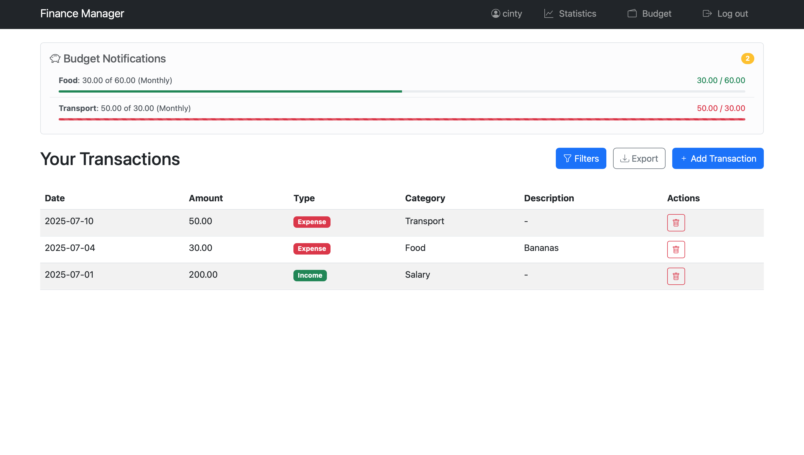
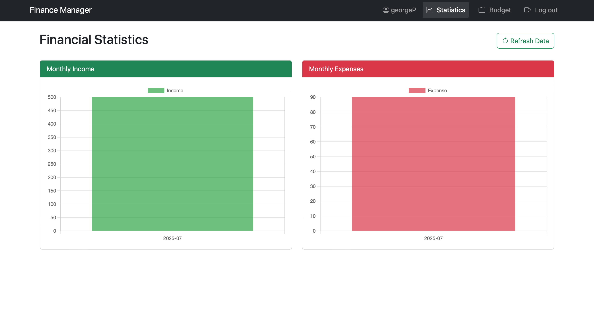
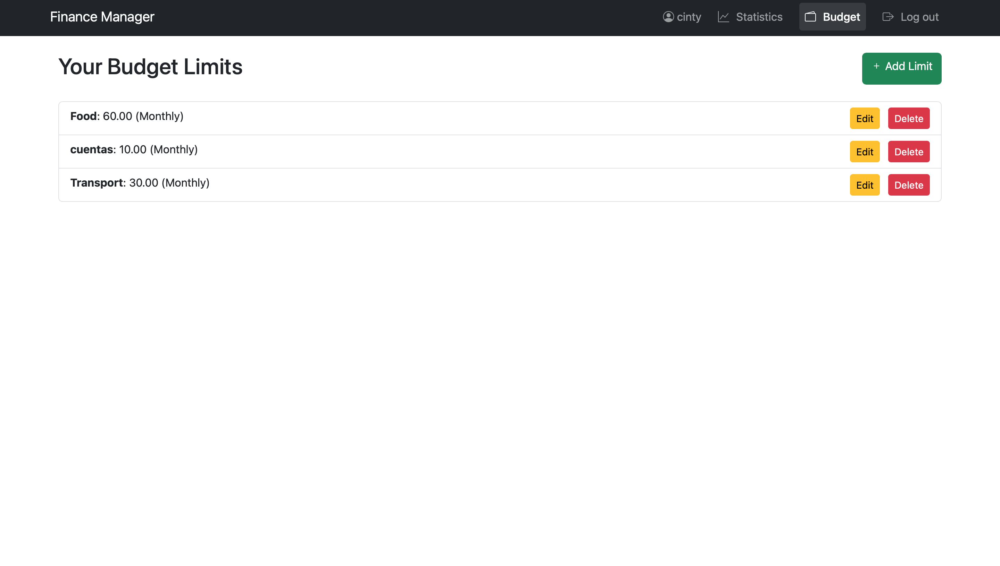
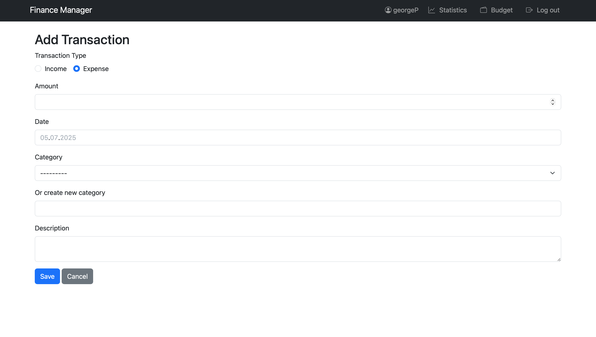

# Finance Manager

## 📝 Description
Django-powered personal finance tracker with income/expense management, visual statistics, and secure user authentication. Perfect for personal budgeting and financial analysis.

## ✨ Features

### 💰 Transactions
- Income/Expense tracking with categories
- CSV export functionality
- Transaction filtering by date/type
- Bulk operations (admin panel)
- Type badges (income/expense) in transaction list

### 📊 Analytics
- Interactive monthly charts (Chart.js)
- Income vs. expense comparison
- Category spending breakdown
- REST API endpoints
- Budget utilization reports

### 🔒 Security
- Password-protected accounts
- CSRF protection
- Session authentication
- Role-based access control
- User-specific data isolation

## 📸 Screenshots

| Transactions | Analytic | Budget | Add Transaction |
|-----------|--------------|-----------|-----------|
|  |  |  |  |

## 🛠 Tech Stack

**Backend:**
- Python 3.10+
- Django 5.0
- Django REST Framework

**Frontend:**
- Bootstrap 5
- Chart.js
- HTML5/CSS3
- Responsive design

## 🚀 Quick Start

### 1. Clone repo
git clone https://github.com/egorpusto/finance-manager.git
cd finance-manager

### 2. Setup environment
python -m venv venv
source venv/bin/activate  # Windows: venv\Scripts\activate

### 3. Install dependencies
pip install -r requirements.txt

### 4. Configure .env
cp .env.example .env
# Edit .env with your settings

### 5. Run migrations
python manage.py migrate

### 6. Create admin
python manage.py createsuperuser

### 7. Start dev server
python manage.py runserver

Visit:

- http://localhost:8000 - App
- http://localhost:8000/admin - Admin panel
- http://localhost:8000/api - API

## 🤝 Contributing
1. Fork the project  
2. Create your branch (`git checkout -b feature/amazing-feature`)  
3. Commit changes (`git commit -m 'Add amazing feature'`)  
4. Push to branch (`git push origin feature/amazing-feature`)  
5. Open a Pull Request  

## 🧪 Testing

Run tests with:

python manage.py test

## 🗂 Project Structure

- `finance/`
  - `transactions/` — Main app
    - `migrations/` — Database migrations
    - `static` - Static files
    - `templates/` — HTML templates
    - `__init__.py`
    - `admin.py` - Admin config
    - `apps.py`
    - `forms.py` — Transaction forms
    - `managers.py` - Custom model managers
    - `mixins.py` - View mixins and base classes
    - `models.py` — Data models
    - `signals.py` - Post-save hooks
    - `tests.py` - Unit tests
    - `urls.py` — App URLs
    - `utils.py` - Helper functions
    - `views.py` — View logic
  - `finance/` — Project config
    - `__init__.py`
    - `asgi.py`
    - `settings.py` — Django settings
    - `urls.py` — Project URLs
    - `wsgi.py`
  - `.env.example` - Environment variables template
  - `.gitignore` - Specifies untracked files
  - `manage.py` — Management script
  - `requirements.txt` — Dependencies

## ⚙️ Configuration

### Create .env file with:

SECRET_KEY=your-secret-key-here
DEBUG=True
DATABASE_URL=sqlite:///db.sqlite3  # Or your PostgreSQL URL

---

Made with ❤️ by egorpusto