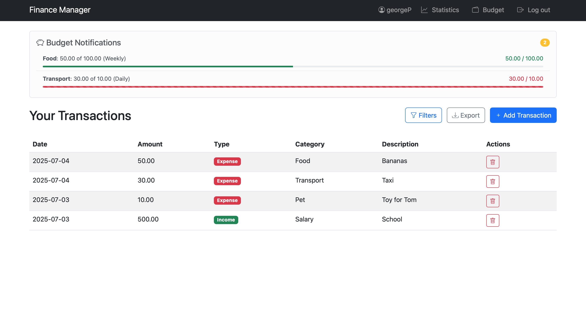

# 💰 Finance Manager - Django Web Application

Django-powered personal finance tracker with income/expense management, visual statistics, and secure user authentication. Perfect for personal budgeting and financial analysis.


## 🎯 Project Overview

A clean, production-ready personal finance manager with user authentication, transaction tracking, budget limits with email alerts, CSV import/export, and a full REST API with Swagger documentation. Built as a portfolio project demonstrating Django best practices, Docker infrastructure, and REST API design.

## ✨ Features

### Transactions
- Create, edit, and delete income/expense transactions
- Categorize transactions with user-specific categories
- Filter by type, category, and date range
- Pagination (10 transactions per page)
- Export transactions to CSV
- Import transactions from CSV with validation and error reporting

### Budget
- Set budget limits per category (daily / weekly / monthly)
- Real-time budget alerts with progress bars
- Email notifications when budget is exceeded
- Visual warnings at 80%+ usage

### Statistics
- Monthly income/expense charts (Chart.js)
- Cached statistics with automatic invalidation on new transactions

### Users
- Registration with auto-login and default categories
- Each user sees only their own data
- Protection against accessing other users' data (404)

### API
- Full REST API with DRF
- Token + Session authentication
- Filtering, ordering, and pagination
- Income/expense/balance summary endpoint
- Interactive Swagger documentation

## 🛠️ Tech Stack

### Backend
- **Django** 5.2 — Web framework
- **Django REST Framework** 3.15 — REST API
- **PostgreSQL** 16 — Primary database
- **Redis** 7 — Celery broker
- **Celery** — Background task processing
- **django-filter** — Declarative API filtering
- **drf-spectacular** — OpenAPI schema + Swagger UI
- **djangorestframework-simplejwt** — JWT authentication
- **python-decouple** — Environment configuration

### Frontend
- **Bootstrap** 5.3 — UI framework
- **Bootstrap Icons** — Icon set
- **Chart.js** — Statistics charts

### Infrastructure
- **Docker** & **Docker Compose** — Containerization (3 services)
- **GitHub Actions** — CI/CD (lint + test)

### Testing & Quality
- **Django TestCase** — 26 tests
- **black** — Code formatter
- **isort** — Import sorter
- **flake8** — Linter
- **pre-commit** — Automated code quality hooks

## 🚀 Getting Started

### Prerequisites

- Docker & Docker Compose

### Installation

1. **Clone the repository:**
```bash
git clone https://github.com/egorpusto/finance-manager.git
cd finance-manager/finance
```

2. **Create `.env` file:**
```bash
cp .env.example .env
```

3. **Run with Docker:**
```bash
docker compose up --build
```

The app will be available at `http://localhost:8000`.
Migrations run automatically on startup.

4. **Create superuser:**
```bash
docker compose exec web python manage.py createsuperuser
```

## 🧪 Testing

```bash
docker compose exec web python manage.py test transactions
```

### Test Suite — 26 tests

| Class | Tests |
|---|---|
| `CategoryModelTest` | 3 |
| `TransactionModelTest` | 4 |
| `BudgetUtilsTest` | 4 |
| `TransactionListViewTest` | 3 |
| `TransactionDetailViewTest` | 2 |
| `CreateTransactionViewTest` | 3 |
| `ExportTransactionsViewTest` | 2 |
| `TransactionFormTest` | 3 |
| `BudgetLimitFormTest` | 2 |
| **Total** | **26** |

## 🔌 API

Base URL: `/api/`
Interactive docs: `/api/docs/`

| Endpoint | Methods | Description |
|---|---|---|
| `/api/transactions/` | GET, POST | List / create transactions |
| `/api/transactions/{id}/` | GET, PUT, PATCH, DELETE | Transaction detail |
| `/api/transactions/summary/` | GET | Income / expense / balance summary |
| `/api/categories/` | GET, POST | List / create categories |
| `/api/categories/{id}/` | GET, PUT, PATCH, DELETE | Category detail |
| `/api/budgets/` | GET, POST | List / create budget limits |
| `/api/budgets/{id}/` | GET, PUT, PATCH, DELETE | Budget limit detail |

### Authentication

```bash
# Get token
curl -X POST http://localhost:8000/api/auth-token/ \
  -d "username=user&password=pass"

# Use token
curl http://localhost:8000/api/transactions/ \
  -H "Authorization: Token <your_token>"
```

### Filtering & Ordering

```bash
# Filter by type
GET /api/transactions/?type=expense

# Filter by category
GET /api/transactions/?category=1

# Filter by date range
GET /api/transactions/?date_from=2024-01-01&date_to=2026-01-31

# Order by amount descending
GET /api/transactions/?ordering=-amount

# Get balance summary
GET /api/transactions/summary/
```

## 📁 CSV Import Format

```csv
Date,Amount,Type,Category,Description
2026-03-01,1500.00,income,Salary,Monthly salary
2026-03-05,45.00,expense,Food,Groceries
2026-03-10,20.00,expense,Transport,Metro
```

- **Date** — `YYYY-MM-DD`
- **Type** — `income` or `expense`
- **Category** — created automatically if not exists
- **Description** — optional

## 🌍 Environment Variables

| Variable | Description | Default |
|---|---|---|
| `SECRET_KEY` | Django secret key | — |
| `DEBUG` | Debug mode | `False` |
| `DB_NAME` | PostgreSQL database name | — |
| `DB_USER` | PostgreSQL user | — |
| `DB_PASSWORD` | PostgreSQL password | — |
| `DB_HOST` | PostgreSQL host | `db` |
| `DB_PORT` | PostgreSQL port | `5432` |
| `EMAIL_BACKEND` | Email backend | `console` |
| `EMAIL_HOST` | SMTP host | `smtp.gmail.com` |
| `EMAIL_PORT` | SMTP port | `587` |
| `EMAIL_USE_TLS` | Use TLS | `True` |
| `EMAIL_HOST_USER` | SMTP login | — |
| `EMAIL_HOST_PASSWORD` | SMTP password | — |
| `DEFAULT_FROM_EMAIL` | From address | — |

## 🐳 Docker Services

| Service | Image | Port |
|---|---|---|
| `web` | Custom (Django) | 8000 |
| `db` | postgres:16-alpine | 5432 |
| `redis` | redis:7-alpine | 6379 |
| `celery_worker` | Custom (Celery) | — |

### Useful Commands

```bash
# Start all services
docker compose up -d

# View logs
docker compose logs -f web

# Run tests
docker compose exec web python manage.py test transactions

# Run migrations manually
docker compose exec web python manage.py migrate

# Stop all services
docker compose down

# Reset database
docker compose down -v
```

## 🗄️ Database Schema

### Transaction
```
- id: BigInteger (Primary Key)
- user: ForeignKey → auth.User
- amount: Decimal(10, 2)
- date: Date
- type: VARCHAR(7) [income, expense]
- category: ForeignKey → Category (nullable)
- description: TEXT
```

### Category
```
- id: BigInteger (Primary Key)
- user: ForeignKey → auth.User
- name: VARCHAR(100)
- UniqueConstraint: (user, name)
```

### BudgetLimit
```
- id: BigInteger (Primary Key)
- user: ForeignKey → auth.User
- category: ForeignKey → Category
- limit_amount: Decimal(10, 2)
- period: VARCHAR(10) [DAY, WEEK, MONTH]
- UniqueConstraint: (user, category, period)
```

## 🏗️ Project Structure

```
finance/
├── finance/                  # Project settings
│   ├── settings.py
│   ├── urls.py
│   ├── asgi.py
│   └── wsgi.py
├── transactions/             # Main app
│   ├── migrations/
│   ├── templates/
│   │   ├── registration/     # Auth templates
│   │   └── transactions/     # App templates
│   ├── static/
│   ├── models.py             # Transaction, Category, BudgetLimit
│   ├── views.py              # CBVs + DRF ViewSets
│   ├── serializers.py        # DRF serializers
│   ├── forms.py              # Django forms
│   ├── utils.py              # Budget logic + CSV import
│   ├── signals.py            # Cache invalidation + email alerts
│   ├── managers.py           # Custom querysets
│   ├── admin.py
│   ├── mixins.py
│   ├── urls.py
│   ├── apps.py
│   └── tests.py              # 26 tests
├── Dockerfile
├── docker-compose.yml
├── entrypoint.sh
├── requirements.txt
├── .env.example
├── .gitignore
└── README.md
```

## 🔄 CI/CD Pipeline

Every push and pull request to `main` triggers:

✅ **Lint** — black, isort, flake8
✅ **Tests** — Full test suite with PostgreSQL and Redis

## 🔒 Security

- **CSRF protection** — All forms protected
- **Login required** — All views require authentication
- **Object-level protection** — Users can only access their own data (404 on foreign objects)
- **Environment variables** — Secrets never hardcoded
- **Password validation** — Django built-in validators
- **Category ownership validation** — API serializer validates category belongs to user

## 📸 Screenshots

| Transactions | Statistics | Budget | Add Transaction |
|-----------|--------------|-----------|-----------|
|  |  |  |  |

## 👤 Author

**Egor Pusto**
- GitHub: [@egorpusto](https://github.com/egorpusto)

## 📄 License

This project is for educational purposes.
